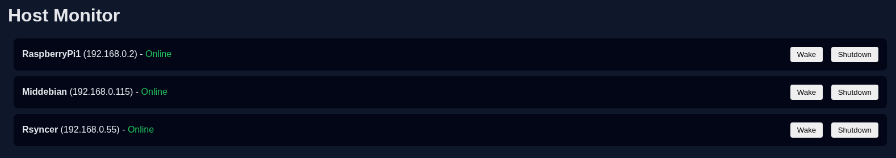

# homectl

A self-hosted web application running on Apache that provides a simple and secure control interface for managing machines in a homelab environment.



## Motivation

The main motivation behind this project is to create a practical learning environment for exploring the fundamentals of web technologies and web server infrastructure while integrating them into a real and useful system. This project is designed both as a practical homelab tool to demonstrate Linux administration, networking, web integration, docker and automation.

## Usage

This project is deployed using Docker Compose and runs two services:

- backend: Node.js API for monitoring, Wake-on-LAN, and shutdown
- frontend: Apache web interface

1. Configure hosts

> Edit the backend [hosts](backend/hosts.json) list before starting

Make sure:
- IPs are reachable from the Docker host
- MAC addresses are correct for Wake-on-LAN
- SSH keys exist for shutdown (~/.ssh is mounted into the container)

2. Build and start services

```bash
docker compose up -d --build
```

3. Access the web interface at: http://localhost:8080
